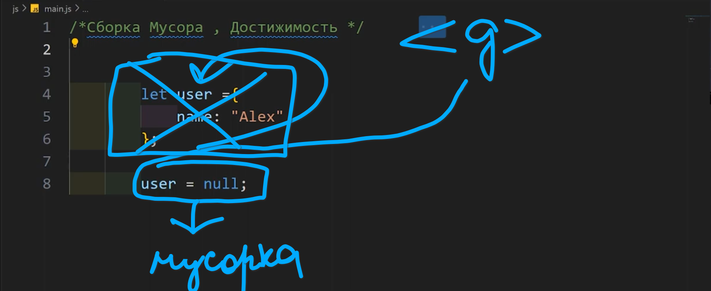

## Garbege Collectro-xo
>[!TIP]
>mo dar js primitv,object va function... mesozem  xamai in joii muayyanero giriftaast dar saxtafzori komputeri mo (chi mewavad ki az xamin kod chize nolozim xast va kori xudro ijro namekunad tanxo qisme az xotirai komputerro megirad) dar in xolat ba mo Gebege collector lozim mewavad
#### upravlenie pamayatyu v js  vipolnyaetsya avftomaticheski i dlya etogo ne nuzhno delat ne chego  i est osnovnoe slovo kak dostizhimost


#### dostizhimei znacheniya eto tskie znachenia kotorie dostupni ili ispolzuyutsya na danniy moment eto to chto u nas v pamyati `suwestvuet baza i mnozhestvo kotorie ne mogut bit udaleni naprimer :function, peremenixoi lokallii function yo ki function-xoi digar dar daruni xamon function yo lokalni peremenixoi xamon functioni dar daruni function budan`


## ⬆️ xamai in znacheniyaxoro udalit kardan nomumkin xast
 

# ammo digar chizxoro mo udalit karda metavonem ba misoli object...


### ⬆️ in object globali xast va misli function declaration mo dar xamajo dostup dorem


### in objecti global dar xud object dorad ki name:"Alex" xast




### in tavre ki mo znacheniyaro baxwidem ba null udalit wud xama chizi mo i metona bina ki user=null tamom digar namebina xichi baroi on ki mo baxwidem ba xichi xami noma yane ba null 


### `bo yak chizi digar ki ves uzer udalit namewavad tanxo znacheniyai daruni vai`


>[!TIP]
>snorwik musora 2 tip dora
### Фаза маркировки (Marking Phase): 
`Сборщик мусора начинает с набора корней (например, глобальные переменные и локальные переменные в текущем контексте выполнения) и отмечает все достижимые (доступные) объекты. Эти объекты считаются "живыми".`

### Фаза очистки (Sweeping Phase):
`После маркировки сборщик мусора сканирует память и идентифицирует объекты, которые не были отмечены. Эти объекты недоступны и считаются "мусором". Память, занимаемая этими объектами, освобождается.`

```js
function createObject() {
    let obj = {};
    obj.name = "Тест";
    obj.value = 123;
    return obj;
}

let myObject = createObject();
// myObject createObject()-tda silatsa mewava
myObject = null; //ak i musorka raft kakbi
```

#### xami vaqte ki mo null da mebaxwemw ak kak bi i uudalit namekna lekin vaqte ki sborwik musora mebina null-dai udalit mekna i vsyo


## Генерационная сборка мусора
`Для оптимизации некоторые современные JavaScript-движки, такие как V8 (используемый в Chrome и Node.js), реализуют стратегию генерационной сборки мусора.`
* Молодое поколение (Young Generation): Здесь размещаются новые объекты. Поскольку большинство объектов живут недолго, молодое поколение собирается чаще.
* Старое поколение (Old Generation): Объекты, которые пережили несколько циклов сборки мусора, перемещаются в старое поколение, которое собирается реже.

